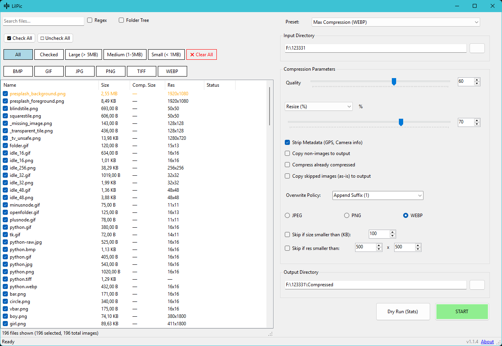

# LilPic

LilPic is a powerful and lightweight bulk image compressor for Windows. It allows you to quickly process large collections of images with fine-grained control over quality, size, and metadata.

<p align="center">
  
</p>

## Screenshots

<p align="center">
  
</p>

## Features

- **Batch Processing**: Compress hundreds of images at once with a single click.
- **Multiple Formats**: Support for **JPEG**, **PNG**, and **WEBP** output formats.
- **Fine-grained Compression**:
  - Adjustable quality slider (1-100).
  - Resizing by percentage or absolute dimensions.
- **Metadata Management**: Option to strip sensitive metadata (GPS, camera info, EXIF).
- **Advanced Filtering**:
  - Filter images by size (Small, Medium, Large).
  - Regex-based file searching.
  - Custom selection (Check/Uncheck All).
- **Flexible Workflows**:
  - **Dry Run**: Estimate file sizes before actually processing.
  - **Overwrite Policies**: Overwrite existing files, skip them, or automatically append a suffix.
  - **Recursive Processing**: Support for folder tree structures.
- **Additional Options**:
  - Copy non-image files to output directory.
  - Compress already compressed images.
  - Skip images smaller than a certain size or resolution.

> [!WARNING]
> The **Console/CLI mode** is currently experimental and may not work as expected as it hasn't been thoroughly tested. It is recommended to use the GUI for critical tasks.

## Quick Start

### 🚀 Download & Run
The easiest way to use LilPic is to download the latest executable from the **[Releases](https://github.com/GetTheNya/LilPic/releases)** page.

1. Download `LilPic.zip`.
2. Extract the files.
3. Run `LilPic.exe`.

## Advanced Usage

### Prerequisites

- [.NET 8.0 SDK](https://dotnet.microsoft.com/download/dotnet/8.0)

### Installation & Run

1. Clone the repository:
   ```bash
   git clone https://github.com/GetTheNya/LilPic.git
   ```
2. Navigate to the project directory:
   ```bash
   cd LilPic
   ```
3. Run the application:
   ```bash
   dotnet run
   ```

## Built With

- **[SkiaSharp](https://github.com/mono/SkiaSharp)** - High-performance 2D graphics for 2D graphics systems.
- **[ExifLibNet](https://github.com/skylot/ExifLibNet)** - Library for reading and writing EXIF metadata.
- **[ShellProgressBar](https://github.com/Mpdreamz/shellprogressbar)** - A beautiful progress bar for terminal output (Console mode).

## License

This project is licensed under the **MIT License** - see the [LICENSE](LICENSE) file for details.
